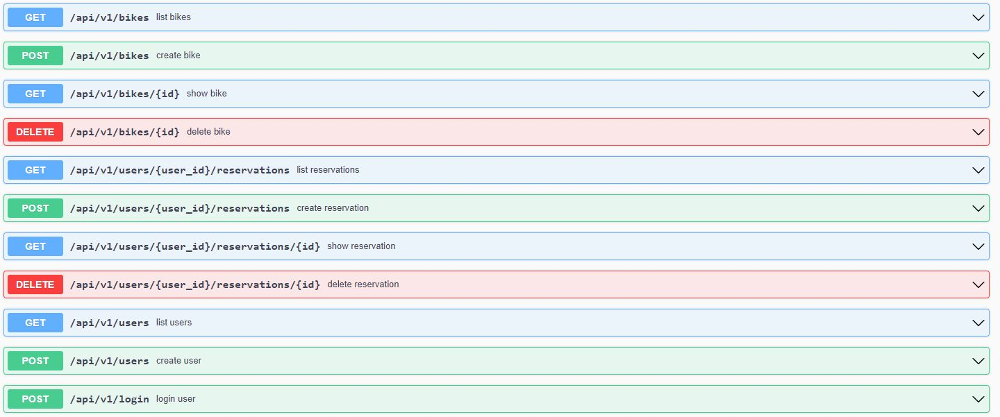
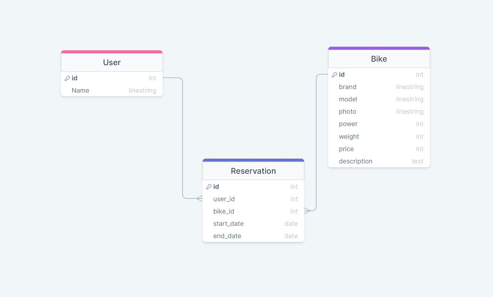

# Final Capstone Backend
 This is the Final Capstone's backend, it is a rails API made to serve as the database to our Final Capstone's frontend made with React.
<hr>

## Built With
   
-  Ruby (programming language)
-  Rails (framework)
-  PostgreSQL (database)
-  Linters: [Rubocop](https://rubocop.org/)
-  Linters: [Stylent](https://stylelint.io/)
-  Visual Studio Code (code editor)
-  RSpec (testings) 
<hr>

 ## API Documentation
 

- [Final Capstone Database](#)
<hr>

 ## SQL schema
 

<hr>

## Getting Started

To get a local copy up and running follow these simple steps.

### Prerequisites

-  A code editor like Visual Studio Code with Git and Ruby.

You can check if Git is installed by running the following command in the terminal.
```
$ git --version
```

Likewise for Ruby installation.
```
$ ruby --version && irb
```

### Install

    In the terminal, navigate to where you wish the repo to be located and run these commands.

```
$ git clone https://github.com/AbrahaKahsay/final-capstone-backend.git
```
```
$ cd final-capstone-backend
```
```
$ bundle install
```
```
$ rails server
```

### Run tests

To install rspec, in the terminal kindly run this command

```
$ gem install rspec
```

To run tests, please run this command

```
$ rspec ./spec/#{file_path}/#{file_name}_spec.rb
```
<hr>

## Authors

👤 **Abraha Kahsay**

- GitHub: [@AbrahaKahsay](https://github.com/AbrahaKahsay)

👤 **Alejandro Torres**

- GitHub: [@aizjicod](https://github.com/aizjicod)

👤 **Jesús Vázquez**

- GitHub: [@jevazquezb](https://github.com/jevazquezb)

👤 **Lucas Costa Rodrigues**

- GitHub: [@lucas-crodrigues](https://github.com/lucas-crodrigues)

- Twitter: [@lcrodrigues58](https://twitter.com/lcrodrigues58)

- LinkedIn: [Lucas Costa Rodrigues](https://www.linkedin.com/in/lucascostarodrigues/)
<hr>

## 🤝 Contributing

Contributions, issues, and feature requests are welcome!

Feel free to check the [issues page](../../issues/).
<hr>

## Show your support
Give a ⭐️ if you like this project!
<hr>

## Acknowledgments

- [Microverse](https://github.com/microverseinc) team.
- Coding Partners.
- Code Reviewers.
<hr>

## 📝 License

This project is [MIT](./LICENSE) licensed.
